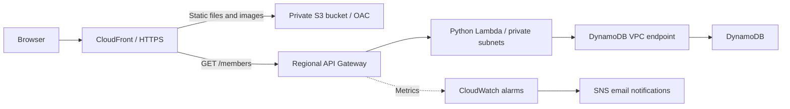

# Secure 3-Tier Cloud App

A Cloud Security term project for KMUTNB, combining a React website with a serverless AWS backend and Terraform infrastructure. The website presents the architecture, project reports, and group members fetched from DynamoDB.

## Architecture



- **Presentation tier:** React 18 and Vite, delivered through CloudFront from a private S3 bucket.
- **Application tier:** API Gateway invokes a Python 3.13 Lambda function in two private subnets.
- **Data tier:** DynamoDB stores member records; the Lambda function reads them through a VPC endpoint.

The frontend uses the relative path `/members`. During development, Vite proxies it to API Gateway. In production, CloudFront routes it to API Gateway and adds the configured stage path.

See [architecture.mmd](architecture.mmd) and [fronend/file/diagram.svg](fronend/file/diagram.svg) for the project diagrams.

## Features

- Architecture diagram with zoom and pan controls.
- PDF previews and a paginated report viewer using `react-pdf`.
- On-demand member loading with loading, error, and retry states.
- Private S3 access through CloudFront Origin Access Control (OAC).
- HTTPS delivery, S3 encryption, and DynamoDB encryption and point-in-time recovery.
- API throttling and CloudWatch alarms with SNS email notifications.
- Terraform-managed infrastructure, frontend uploads, member images, and Lambda packaging.

## Repository Structure

```text
.
|-- fronend/                      # React/Vite frontend
|   |-- file/                     # Diagram, logos, and PDF reports
|   |-- scripts/
|   |   `-- copy-dist-to-terraform.mjs # Postbuild copy to a sibling repository
|   |-- src/
|   |   |-- App.jsx               # Website and member API requests
|   |   |-- PdfViewer.jsx         # PDF viewer and previews
|   |   |-- main.jsx              # React entry point
|   |   `-- styles.css
|   |-- index.html
|   |-- package.json
|   |-- package-lock.json
|   `-- vite.config.js            # Local API proxy configuration
|-- backend/
|   |-- get_members.py            # GET /members handler
|   `-- tests/                    # Local-only unit tests, excluded from Lambda ZIP
|-- infrastructure/
|   |-- files/images/             # Member images uploaded to S3
|   |-- modules/                  # VPC, DynamoDB, IAM, Lambda, API, S3, CDN, logs, SNS
|   |-- tests/                    # Offline mocked Terraform security tests
|   `-- *.tf                      # AWS resources and outputs
|-- architecture.mmd
|-- tasks                         # Frontend development and formatting tasks
`-- README.md
```

## Prerequisites

- Node.js 20.19+ or a supported newer LTS release, with npm.
- Terraform `>= 1.5.0, < 2.0.0`.
- AWS CLI with an authenticated profile and permissions to manage the project resources.
- An AWS account with access to the configured region, defaulting to `ap-southeast-7`.
- An email address for SNS alarm notifications.

Terraform uses the AWS provider `~> 5.0` and archive provider `~> 2.7`. Python does not need to be installed locally merely to package and deploy the Lambda source.

## Local Development

Use the root-level shell task list to avoid changing directories:

```sh
./tasks
./tasks setup
./tasks dev
```

For first-time development, `./tasks setup` checks that Node.js 20.19+ and npm are available, then installs frontend dependencies, including development tools, from the lockfile. Install Node.js yourself if it is missing. Setup does not install system tools, configure AWS, or deploy resources. Use `./tasks install` to reinstall dependencies later.

Arguments are forwarded to the selected command, for example `./tasks dev --port 5174`. The script also works when invoked by its path from another directory.

Alternatively, run npm directly. From the repository root:

```sh
cd fronend
npm ci
npm run dev
```

Open the URL printed by Vite, normally `http://localhost:5173`.

The development proxy in [fronend/vite.config.js](fronend/vite.config.js) currently targets an existing API Gateway endpoint and rewrites `/members` to `/dev/members`. To use your own deployment, replace `target` with your API Gateway base URL and update the stage in `rewrite` if necessary.

The website can run without deploying AWS resources, but loading members requires a reachable API. There is no local mock API configured.

## Frontend Formatting

From the repository root:

```sh
./tasks format-check
```

This runs Prettier on the frontend source, build scripts, HTML entry point, Vite configuration, and package manifest. It exits with a nonzero status when formatting differs and does not change files. To apply formatting, run `./tasks format`.

Inside `fronend/`, the equivalent npm commands are `npm run format:check` and `npm run format`. These tasks do not format Python or Terraform, create a Lambda ZIP, or deploy resources.

## Local Unit Tests

With Python 3.13 installed, run from the repository root:

```sh
python3 -m unittest discover -s backend/tests -v
```

[backend/tests/test_get_members.py](backend/tests/test_get_members.py) uses Python's built-in `unittest` and mocks `boto3` and DynamoDB. No additional packages, AWS credentials, or network access are required. The tests cover scan pagination, empty results, image URLs, Decimal serialization, and error responses.

Tests run only locally and do not create or upload a Lambda ZIP. Terraform packages only `backend/get_members.py` through `archive_file.source_file`, so the `backend/tests/` directory is excluded from the deployed function.

## Lambda Tasks

With Python 3.13 installed, run from the repository root:

```sh
./tasks lambda-setup
./tasks lambda-test
./tasks lambda-format-check
./tasks lambda-lint
```

`lambda-setup` creates `backend/.venv/` and installs Ruff from [backend/requirements-dev.txt](backend/requirements-dev.txt). The other Lambda tasks automatically use that environment when available. Without setup, `lambda-test` uses `python3` and needs only the standard library. Set `PYTHON` to an executable path to choose a different interpreter; formatting and lint tasks require Ruff installed in that interpreter. Task names retain the `lambda-` prefix because the backend runs on AWS Lambda.

`lambda-format-check` reports formatting differences without modifying files. Run `./tasks lambda-format` to apply formatting. `lambda-lint` checks the handler and tests with Ruff's `E4`, `E7`, `E9`, and `F` rules for basic code errors and Pyflakes checks. Ruff runs in isolated mode so external configuration does not change these tasks. Both checks return a nonzero status when they find issues.

These tasks work from other directories when invoked using the launcher's path. The virtual environment is ignored by Git. Tests, development dependencies, and tooling are not included in the Lambda ZIP; no task in this section packages or deploys AWS resources.

## Deploy to AWS

Use the root task launcher for Terraform commands:

```sh
./tasks terraform-init
./tasks terraform-fmt-check
./tasks terraform-validate
./tasks terraform-plan -out=deploy.tfplan
./tasks terraform-apply deploy.tfplan
```

Short aliases `init`, `fmt`, `fmt-check`, `validate`, `plan`, `apply`, and `destroy` are also supported, for example `./tasks plan`. `./tasks terraform-fmt` rewrites formatting recursively; `terraform-fmt-check` only reports differences. Both include tfvars files, so use explicit filenames if you want to restrict the formatting scope.

Every Terraform task runs in `infrastructure/` regardless of your current directory. Relative plan and variable-file paths are resolved there. Extra arguments are forwarded unchanged; no `-auto-approve` is added. Applying a saved plan follows Terraform's native behavior and does not ask for another approval. Review the plan first. To delete the stack, use `./tasks terraform-destroy`; this uses Terraform's normal confirmation prompt unless you explicitly pass options to override it.

See [infrastructure/README.md](infrastructure/README.md) for the Terraform root-module layout, inputs, outputs, and state-handling guidance.

Deployment creates billable AWS resources. Review the Terraform plan before applying it. For an existing deployment, preserve its state and use the original account, profile, and region.

### 1. Configure AWS and Terraform

Authenticate with the profile you intend to use. For a credentials-based profile:

```sh
aws configure --profile personal
aws sts get-caller-identity --profile personal
```

For an AWS SSO profile, use your organization's SSO configuration and login flow instead.

Create a local `infrastructure/terraform.tfvars` with your values:

```hcl
aws_profile        = "personal"
aws_region         = "ap-southeast-7"
project_name       = "secure-3tier-infrastructure"
environment        = "dev"
api_stage_name     = "dev"
notification_email = "you@example.com"
```

Only `notification_email` has no default. Keep real configuration values and credentials out of Git; tfvars files are ignored.

### 2. Build and Stage the Frontend

**Important:** Running `npm run build` inside `fronend/` runs a postbuild script that copies `fronend/dist/` to the sibling repository `../secure-3tier-infrastrcuture/terraform/dist/` (relative to this repository's root), not to this repository's `infrastructure/dist/`.

To deploy using the Terraform configuration in this repository, run from the repository root:

```sh
cd fronend
npx vite build
cd ..
mkdir -p infrastructure/dist
cp -R fronend/dist/. infrastructure/dist/
```

Running Vite directly avoids the npm postbuild hook. Terraform uploads files from `infrastructure/dist/`; building only `fronend/dist/` is not sufficient. On subsequent builds, remove obsolete files from the staging directory so old assets are not included in the deployment.

### 3. Apply Infrastructure

```sh
cd infrastructure
terraform init
terraform validate
terraform plan -out=deploy.tfplan
terraform apply deploy.tfplan
```

Terraform creates the resources and uploads the staged frontend and member images. CloudFront provisioning can take several minutes.

Confirm the SNS subscription using the email sent to `notification_email`; notifications will not be delivered until the subscription is confirmed.

### 4. Verify the Deployment

From the `infrastructure/` directory:

```sh
terraform output -raw cloudfront_base_url
terraform output -raw members_api_url
curl --fail "$(terraform output -raw cloudfront_base_url)/members"
```

Open `cloudfront_base_url` in a browser and load the members section. The API returns a JSON array of member records on success, or HTTP 500 with a generic error message on failure.

Other outputs include `frontend_bucket_name` and `alarm_topic_arn`.

## Updating the Project

### Frontend and Documents

Update files in `fronend/src/` or `fronend/file/`, rebuild and stage the frontend, then run Terraform plan and apply again. The S3 objects use file hashes to detect changes.

If CloudFront continues serving an older page after deployment, invalidate `/index.html` and `/` in the CloudFront console, or use `/*` when a full cache refresh is needed.

Run frontend npm commands inside `fronend/`. `npm run preview` previews the built frontend locally, but the API proxy is configured for the development server, not preview. Use `npm run dev` to test member loading locally.

### Lambda

Update [backend/get_members.py](backend/get_members.py), then run Terraform plan and apply from `infrastructure/`.

The `archive_file` data source creates `infrastructure/get-members.zip`. Its hash is assigned to `source_code_hash`, so a changed archive triggers a Lambda code update. A saved plan should be regenerated if you change the source after planning.

The archive currently contains only `get_members.py`. Additional Python modules or third-party dependencies require changes to the packaging configuration. The current handler uses `boto3`, available in the AWS Lambda Python runtime.

### Member Records and Images

- Terraform-managed member records are defined in [infrastructure/locals.tf](infrastructure/locals.tf) and created in [infrastructure/modules/dynamodb/main.tf](infrastructure/modules/dynamodb/main.tf).
- The table uses `memberId` as its string partition key.
- The handler scans all pages of the table and returns member records with an `imagePath` derived from `studentId`.
- Place matching images in `infrastructure/files/images/` as `<studentId>.jpg`. The upload configuration also accepts JPEG extensions, but the handler generates URLs ending in `.jpg`, so filenames must match those URLs exactly.
- Apply Terraform after changing managed records or images.

## Security and Operations

- S3 public access is blocked; CloudFront uses OAC to read objects. The bucket policy denies insecure transport.
- API Gateway can invoke only the configured Lambda route and stage through the scoped invocation permission.
- `GET /members` is **public**: it currently has no authentication or API key requirement, and the direct API Gateway URL remains accessible. Do not store private member information in the returned records.
- The API method has a rate limit of 2 requests per second and a burst limit of 5.
- CloudWatch alarms notify SNS when API requests exceed 300 or client errors exceed 30 within five minutes.
- Lambda logs are managed in CloudWatch. API Gateway execution logging and X-Ray tracing are currently disabled.
- Avoid committing Terraform state, tfvars, `.env`, credentials, private keys, dependency directories, or build artifacts. Keep `package-lock.json` and `.terraform.lock.hcl` in Git.
- Do not delete Terraform state to reset a deployment; it tracks ownership of existing AWS resources.

## Troubleshooting

| Symptom | What to check |
| --- | --- |
| Members fail to load locally | Check the Vite proxy target, stage path, and API availability. |
| Frontend is missing after apply | Build first and confirm `infrastructure/dist/index.html` exists. |
| Production `/members` fails | Check the CloudFront API behavior, API deployment, stage, and Lambda permission. |
| API returns HTTP 500 | Check Lambda CloudWatch logs, DynamoDB access, and required record fields such as `studentId`. |
| Member images return 404 | Match the filename and case to `<studentId>.jpg`. |
| Old frontend appears | Check staged build files and invalidate the CloudFront cache. |
| Alarm emails do not arrive | Confirm the SNS email subscription. |

## Cleanup

Review the destroy plan before deleting resources:

```sh
cd infrastructure
terraform plan -destroy
terraform destroy
```

This removes project resources and data. The S3 bucket has `force_destroy = false`; if unmanaged objects remain, bucket deletion can fail. Review and remove only the leftover objects belonging to this project before retrying.
